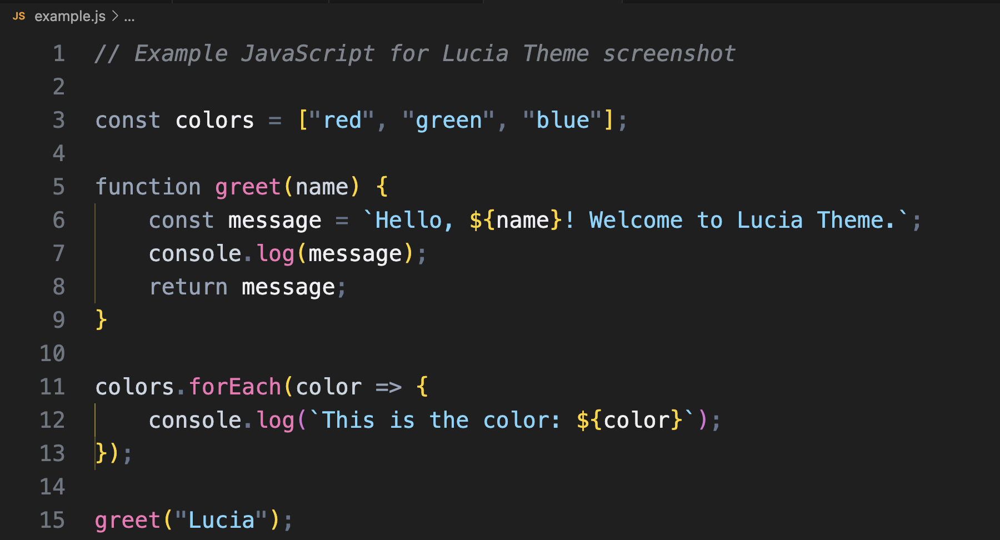
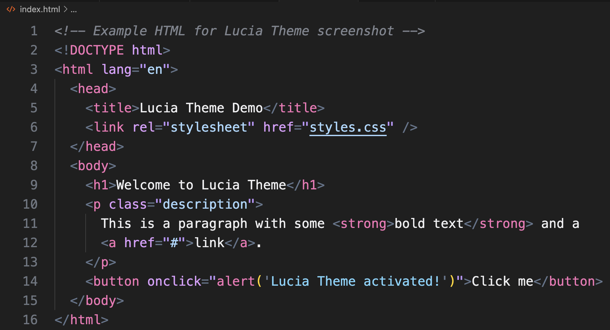
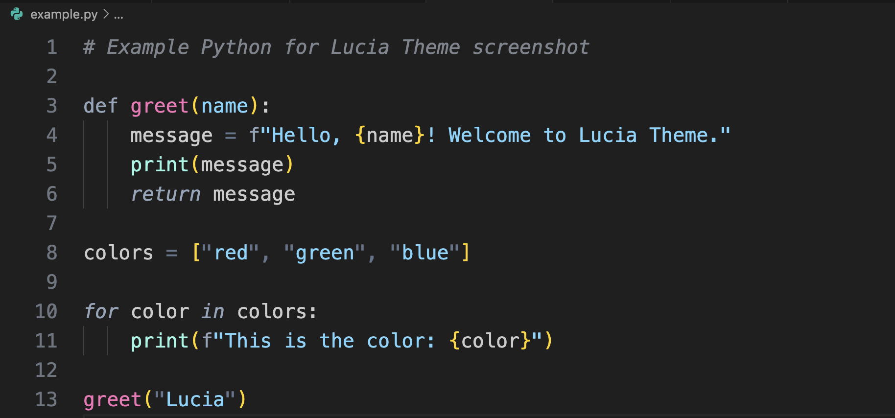
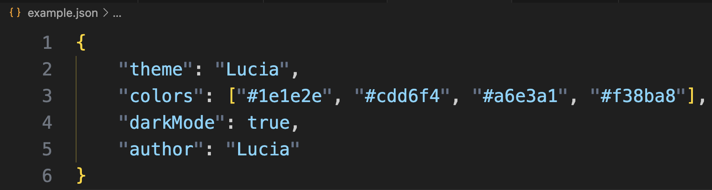

# 🌙 Lucia Theme — Tailwind-Inspired Dark Theme for VS Code

  

## ✨ About Lucia Theme

**Lucia Theme** is a dark theme for Visual Studio Code, inspired by the color palette of **Tailwind CSS**. It’s designed for developers who love a clean, modern look with subtle, balanced contrast.

---

## 🎨 Theme Preview

Here’s a preview of **Lucia Theme** applied to different file types:

### ✨ JavaScript

### ✨ HTML

### ✨ CSS

### ✨ Python

### ✨ JSON

## 🌈 Activating the Theme

1. Open the Command Palette (`Ctrl+Shift+P`).
2. Type Color Theme and select: `Lucia Theme`.

## ⭐ Like this theme?

If you enjoy using Lucia Theme, please leave a ⭐ on the Marketplace and share it with your friends. Suggestions and feedback are always welcome!